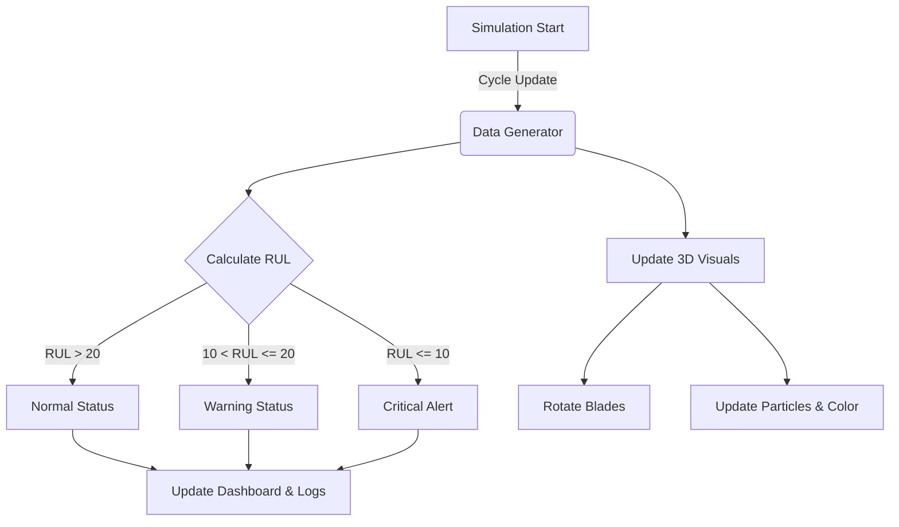

# NCMAPSS
항공기 엔진 예측정비 모델 학습데이터셋 : NCMAPSS DS-08a
# ✈️ Turbofan Engine Digital Twin & PdM Dashboard

> **React Three Fiber를 활용한 항공기 엔진 예지 정비(Predictive Maintenance) 3D 시각화 대시보드**

## 📖 프로젝트 개요 (Project Overview)

이 프로젝트는 **항공기 터보팬 엔진(Turbofan Engine)**의 상태를 웹상에서 실시간으로 모니터링하고, 고장을 사전에 예측하는 **디지털 트윈(Digital Twin)** 애플리케이션입니다.

NASA의 **N-CMAPSS** 데이터셋 개념을 차용하여 자체적인 시뮬레이션 알고리즘을 구축하였으며, 엔진의 회전, 공기 흐름(Airflow), 열화상 변화를 **3D 그래픽**으로 정교하게 구현하여 직관적인 데이터 분석 환경을 제공합니다.

### 🎯 주요 목표
* 복잡한 센서 데이터를 **직관적인 3D 모델**로 시각화
* 엔진의 **RUL(잔여 수명)** 예측 및 임계값 기반 경고 시스템 구현
* 흡기부터 배기까지의 **공기 역학(Airflow)**을 파티클 시스템으로 구현

---

## 🛠 기술 스택 (Tech Stack)

| Category | Technologies |
| :--- | :--- |
| **Core** |   |
| **3D / Graphics** | **React Three Fiber (R3F)**, `@react-three/drei`, `Three.js` |
| **Styling** |  |
| **Data Viz** | `Recharts` (Real-time Charts) |
| **Icons** | `Lucide-react` |

---

## ✨ 핵심 기능 (Key Features)

### 1. 3D 엔진 디지털 트윈 (Interactive 3D Engine)
* **Procedural Modeling:** 외부 모델링 파일 없이 `Three.js`의 Geometry(Cylinder, Cone 등)와 커스텀 알고리즘으로 엔진 형상 구현
* **Dynamic Airflow System:**
    * 4,000개 이상의 파티클을 활용한 유체 흐름 시각화
    * 엔진 섹션(Compressor, Combustor, Turbine)에 따른 유체 **압축(Compression) 및 팽창(Expansion)** 물리 로직 적용
* **Thermal Visualization:** 엔진 내부 온도 변화에 따라 파티클 색상이 변화 (Cold Section 🔵 → Hot Section 🔴)

### 2. 예지 정비 시뮬레이션 (PdM Simulation)
* **RUL 예측 알고리즘:** 사이클 진행에 따른 엔진 노후화(Degradation) 및 고장 패턴 시뮬레이션
* **실시간 상태 모니터링:**
    * `Normal`: 정상 운항
    * `Warning`: 잔여 수명 20 Cycle 미만
    * `Critical`: 잔여 수명 10 Cycle 미만 (즉시 정비 알림)
* **부품별 부하 분석:** Fan, LPC, HPC, HPT, LPT 각 섹션별 실시간 상태 트래킹

### 3. 직관적인 대시보드 UI
* **Maintenance Log:** 시스템 위험 감지 시 자동으로 기록되는 정비 통제 로그
* **Real-time Charts:** RUL 감소 추세 및 부품별 마모도를 실시간 그래프로 표현

---

## 💻 시뮬레이션 로직 (Logic Flow)

이 애플리케이션은 프론트엔드 내부에서 가상 센서 데이터를 생성하고 처리합니다.

## 📊 성능 및 데이터 분석 (Performance & Analysis)

### 1. 모델 성능 평가 (Model Performance)
학습된 모델은 테스트 데이터셋(Unit 8, 9)에서 **R² Score 0.91**의 높은 예측 정확도를 달성했습니다.

| Metric | Value |
| :--- | :--- |
| **RMSE** (평균 제곱근 오차) | 2.6951 cycles |
| **MAE** (평균 절대 오차) | 1.5165 cycles |
| **R² Score** (결정 계수) | 0.9186 |

*최종 모델 성능 평가 결과*

*학습 진행 과정 (Epochs vs RMSE)*

### 2. 데이터 분석 (Data Analysis)
N-CMAPSS 데이터셋의 컴포넌트별 고장 상관관계와 시계열 패턴을 분석하여 모델 설계에 반영했습니다.

📈 데이터 분석 상세 차트 보기 (Click to expand)

**Component Correlation Matrix**
각 부품 센서 간의 상관관계를 분석하여 다중공선성을 파악하고 중요 Feature를 선정했습니다.

**Time Series Patterns**
엔진 사이클이 진행됨에 따라 변화하는 센서 데이터의 시계열 패턴입니다.

**Fault Magnitude Distribution**
각 컴포넌트의 고장 크기 분포를 시각화한 데이터입니다.

